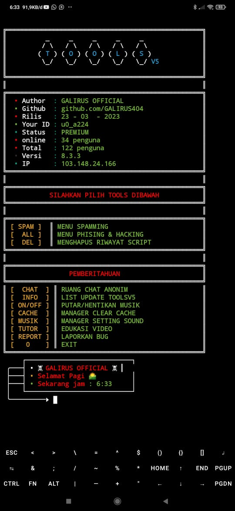

# 🔧 TOOLS V5

**TOOLS V5** adalah kumpulan script dan alat serbaguna berbasis Termux yang dibuat oleh **Galirus Official**.  
Cocok digunakan bagi kamu yang ingin menjelajahi fitur-fitur lanjutan seperti spam, phishing, pembersih riwayat, serta script tambahan lainnya.

---

## 📸 Screenshot



---

## 🧰 Fitur-Fitur TOOLS V5

- 📲 **Spam Tools** — Beragam metode spam (SMS, WA, dll)  
- 🎣 **Phishing Kit** — Template & metode phising siap pakai  
- 🧹 **Pembersih Riwayat** — Menghapus jejak dan file sampah  
- 🛠️ **SC Tambahan** — Script custom dan alat-alat tambahan   
- ⚙️ **Lainnya** — Terus dikembangkan dan diperbarui

---

## 🚀 Cara Instalasi

Jalankan perintah berikut di aplikasi **Termux** kamu:

```bash
pkg update
pkg upgrade -y
pkg install make clang git -y
cd $HOME
git clone https://github.com/Lubebansokhekel/Pasang
cd Pasang
make install
make run
```

# WHATSAPP
https://wa.me/6285850268349
# GMAIL
galirusofficial@gmail.com
